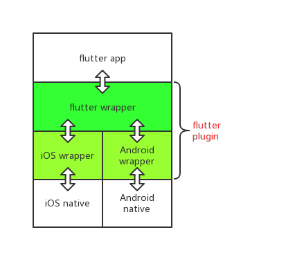

# 简介

Flutter 是谷歌的移动 UI 框架，可以快速在 iOS 和 Android 上构建高质量的原生用户界面。

[详细可以参见](https://flutter.dev/)

`今天的目的主要讲怎么创建一个封装 iOS/android 接口的flutter plugin`

# 创建 plugin

`$ flutter create --org com.example --template=plugin hello_flutter_plugin`

## 整体架构

`flutter plugin` 可简单理解为下图中的 `flutter wrapper`,`iOS wrapper`,`Android wrapper` 三个部分组成，图中的`双向箭头表明了代码的调用逻辑`





## 目录结构

当执行完创建 plugin 的命令之后，flutter 会负责在当前目录创建一个 plugin 项目，具体的目录含义如下


`android/`:Android wrapper

`ios/`：iOS wrapper 

`lib/`：flutter wrapper

`example/`：demo 根目录

`example/android/`：Android project

`example/ios/`：iOS project

`example/lib/`：flutter app


# 开发 plugin

## 获取 flutter 依赖

第一次跑需要使用`终端`进入 plugin 项目路径下执行下面命令获取 flutter 的依赖

`$ flutter packages get`

## 开发工具推荐

iOS：Xcode

Android：Android studio

flutter：VS Code

## 原理

flutter 通过 `MethodChannel` 实现与 native 的交互，可以详细[参见官网介绍](https://flutter.dev/docs/development/platform-integration/platform-channels)

`调用任何接口，flutter 都会把 methodname 和 arguments 传递出去，native 需要根据 methodname 确认 flutter 的操作，然后根据具体的 arguments 处理，反之 native 调用 flutter 也是如此`

`想要了解如何调用的，可以自行在 native 平台 debug`


## flutter wrapper

flutter wrapper 目前所有的接口封装在 `lib/hello_flutter_plugin.dart` 中，可以按需增加新的接口

flutter 通过一个特定的 string 获取一个 methodchannel

```
static const MethodChannel _channel =
      const MethodChannel('hello_flutter_plugin');
```

所有接口全部通过该 methodchannel 进行与 native 的交互

### 运行 flutter 到指定设备


1.保证有一个 iOS 连接电脑，如`iOS 模拟器 或者 iPhone 手机`

2.终端进入 `example` 目录，执行 `flutter devices`，查看可用的设备列表，可能会出现下面的内容，其中第二列为设备 id

```
2 connected devices:

GT I9500  • 4d006b083bc13049                     • android-arm • Android 4.4.2 (API 19)
iPhone Xʀ • BAAD4ECC-F718-4EFF-B9FB-64E1E9A35A3F • ios         • com.apple.CoreSimulator.SimRuntime.iOS-12-2 (simulator)
```

3.然后执行 `flutter run -d 设备id`，即可运行 flutter 到指定设备，如

`flutter run -d BAAD4ECC-F718-4EFF-B9FB-64E1E9A35A3F`

## iOS wrapper

在 iOS 设备上运行过后，会发现项目由 pod 管理，并且自动生成了一个 `GeneratedPluginRegistrant` 类，在其 .m 中就可以看到 iOS 端的 `HelloFlutterPlugin` 类

在 `HelloFlutterPlugin.m` 中就可以看到 iOS 生成 MethodChannel

```
FlutterMethodChannel* channel = [FlutterMethodChannel
      methodChannelWithName:@"hello_flutter_plugin"
            binaryMessenger:[registrar messenger]];
```

iOS 端对于 flutter 的操作放在了单例类 `HelloFlutterWrapper` 中

返回结果给 flutter wrapper 总共有三种方式，`不返回数据`，`通过 FlutterResult 返回数据`，`通过 FlutterMethodChannel 返回数据`

`不返回数据`

```
- (void)initWithAppkey:(id)arg {
    //不用给 flutter 处理了结果
    if([arg isKindOfClass:[NSString class]]) {
        NSString *appkey = (NSString *)arg;
        //可以按照业务需求处理 appkey
        //此处仅打印了 appkey 的内容
        NSLog(@"iOS init 接收的 appkey 为 %@",appkey);
    }
}
```

`通过 FlutterResult 返回数据`

```
- (void)getCurrentUserPhone:(id)arg result:(FlutterResult)result{
    //通过 result 返回结果给 flutter
    if([arg isKindOfClass:[NSString class]]) {
        NSString *userId = (NSString *)arg;
        NSMutableDictionary *dic = [NSMutableDictionary new];
        [dic setObject:userId forKey:@"userId"];
        [dic setObject:@"18512345678" forKey:@"phone"];
        NSLog(@"iOS getCurrentUserPhone 通过 result 返回结果给 flutter 内容为 %@",dic);
        result(dic);
    }
}
```

`通过 FlutterMethodChannel 返回数据`

```
- (void)fetchUserInfo:(id)arg {
    //通过 methodchannel 返回结果给 flutter
    if([arg isKindOfClass:[NSString class]]) {
        NSString *userId = (NSString *)arg;
        NSMutableDictionary *dic = [NSMutableDictionary new];
        [dic setObject:userId forKey:@"userId"];
        [dic setObject:@"iosUserName" forKey:@"name"];
        NSLog(@"iOS fetchUserInfo 通过 methodchannel 返回结果给 flutter 内容为 %@",dic);
        [self.channel invokeMethod:HelloMethodCallBackKeyFetchUserInfo arguments:dic];
    }
}
```


详细可以参见 `HelloFlutterWrapper.m` 的实现

## Android wrapper


在 Android 设备上运行过后，会发现项目由 gradle 管理，并且自动生成了一个 `GeneratedPluginRegistrant` 类，在其源码中就可以看到 Android 端的 `HelloFlutterPlugin` 类

在 `HelloFlutterPlugin.java` 中就可以看到 Android 生成 MethodChannel

```
final MethodChannel channel = new MethodChannel(registrar.messenger(), "hello_flutter_plugin");
```

Android 端对于 flutter 的操作放在了单例类 `HelloFlutterWrapper.java` 中

返回结果给 flutter wrapper 总共有三种方式，`不返回数据`，`通过 FlutterResult 返回数据`，`通过 FlutterMethodChannel 返回数据`

`不返回数据`

```
private void initWithAppkey(Object arg) {
        //不用给 flutter 处理了结果
        if(arg instanceof String) {
            String appkey = String.valueOf(arg);
            //可以按照业务需求处理 appkey
            //此处仅打印了 appkey 的内容
            Log.i("Android","init 接收的 appkey 为 "+appkey);
        }
    }
```

`通过 FlutterResult 返回数据`

```
private void getCurrentUserPhone(Object arg,MethodChannel.Result result) {
        //通过 result 返回结果给 flutter
        if(arg instanceof String) {
            String userId = String.valueOf(arg);
            Map map = new HashMap();
            map.put("userId",userId);
            map.put("phone","18512345678");
            Log.i("Android","getCurrentUserPhone 通过 result 返回结果给 flutter 内容为"+map.toString());
            result.success(map);
        }
    }
```

`通过 FlutterMethodChannel 返回数据`

```
private void fetchUserInfo(Object arg) {
        //通过 methodchannel 返回结果给 flutter
        if(arg instanceof String) {
            String userId = String.valueOf(arg);
            Map map = new HashMap();
            map.put("userId",userId);
            map.put("name","AndroidUserName");
            Log.i("Android","fetchUserInfo 通过 methodchannel 返回结果给 flutter 内容为 "+map.toString());
            methodChannel.invokeMethod(HelloMethodKey.FetchUserInfoCallBack,map);
        }
    }
```


详细可以参见 `HelloFlutterWrapper.java` 的实现


# 源码地址

[github](https://github.com/loginSin/flutter-plugin-template)
